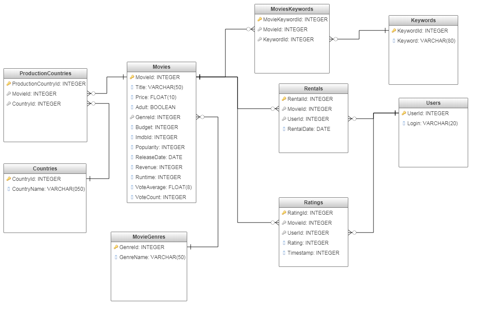

Python and SQL Intro / SQL Platforms
Winter 2018/2019

# On-line movie rental
## JJ movie

Jakub Ajchel
Jerzy Bednarski

Our project will be an on-line video rental platform. Different users will be able to rent videos and pay for them on-line. Each user should have an account on the platform. According to his/her previous choices and other users' choices platform will recommend each user movies which suit him/her.

### Platform will consist of multiple parts:
- web application for customers with login window, search engine, recommendations and cart
- dashboard for platform's owner presenting statistics of video rental
- database with few thousands of movies with their descriptions

### How will we share our duties:
Jakub Ajchel:
- project of database and creating it in SQL Lite
- search engine and payment system

Jerzy Bednarski:
- client-server connection and login page
- dashboard for platform's owner

Both of us:
- recommendation system

Optional part:
- Enabling process of payment transaction using blockchain technology (adding bank entity)

### Database project:

### Project of webpage layout:

#### Login page

#### Main page

